# Context Providers in Microsoft Agent Framework

Context providers are a powerful extensibility mechanism in the Microsoft Agent Framework that enables agents to be enhanced with external context, memory, and retrieval capabilities.

## Table of Contents

- [Overview](#overview)
- [Architecture](#architecture)
- [Core Components](#core-components)
- [Lifecycle](#lifecycle)
- [Building Custom Context Providers](#building-custom-context-providers)
- [Built-in Providers](#built-in-providers)
- [Neo4j as a Context Provider](#neo4j-as-a-context-provider)

---

## Overview

Context providers implement a lifecycle pattern that hooks into the agent's request/response flow:

1. **Before invocation** (`invoking`) - Inject instructions, messages, or tools
2. **After invocation** (`invoked`) - Process responses, update memory, store information
3. **Thread creation** (`thread_created`) - Initialize state for new conversations

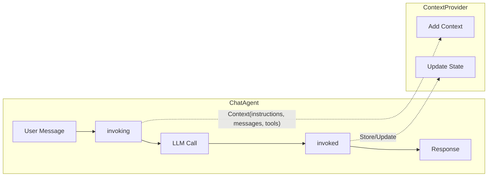

---

## Architecture

### High-Level Data Flow

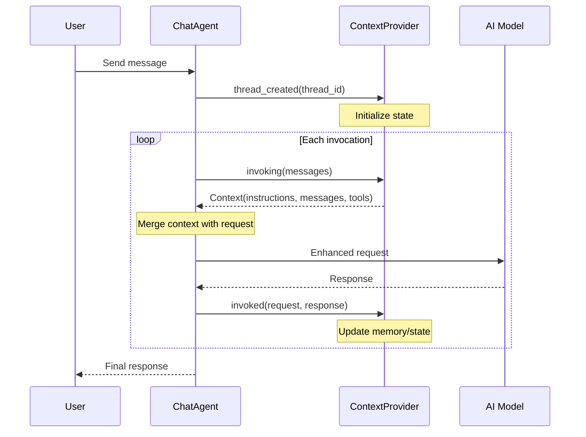

### Multiple Providers with AggregateContextProvider

When multiple providers are used, they're automatically wrapped in an `AggregateContextProvider`:

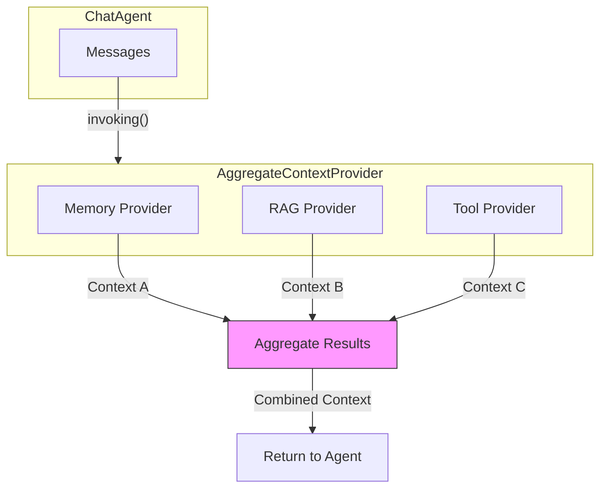

---

## Core Components

### Context Class

The `Context` class contains data returned by a provider's `invoking()` method:

```python
class Context:
    def __init__(
        self,
        instructions: str | None = None,      # Additional system instructions
        messages: Sequence[ChatMessage] | None = None,  # Extra messages to include
        tools: Sequence[ToolProtocol] | None = None,    # Additional tools to provide
    ):
        ...
```

### ContextProvider Abstract Base Class

```python
from abc import ABC, abstractmethod
from agent_framework import Context, ChatMessage

class ContextProvider(ABC):
    # Default prompt for memory context
    DEFAULT_CONTEXT_PROMPT = "## Memories\nConsider the following memories..."

    async def thread_created(self, thread_id: str | None) -> None:
        """Called when a new thread is created."""
        pass

    async def invoked(
        self,
        request_messages: ChatMessage | Sequence[ChatMessage],
        response_messages: ChatMessage | Sequence[ChatMessage] | None = None,
        invoke_exception: Exception | None = None,
        **kwargs: Any,
    ) -> None:
        """Called after the model responds."""
        pass

    @abstractmethod
    async def invoking(
        self,
        messages: ChatMessage | MutableSequence[ChatMessage],
        **kwargs: Any
    ) -> Context:
        """Called before the model is invoked. Must return a Context."""
        pass

    async def __aenter__(self) -> Self:
        """Async context manager entry for setup."""
        return self

    async def __aexit__(self, exc_type, exc_val, exc_tb) -> None:
        """Async context manager exit for cleanup."""
        pass
```

---

## Lifecycle

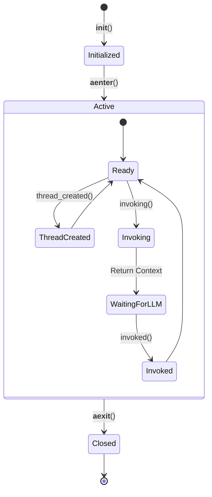

### Method Descriptions

| Method | When Called | Purpose | Returns |
|--------|-------------|---------|---------|
| `__aenter__` | Provider enters context | Setup connections, resources | `Self` |
| `thread_created` | New conversation thread | Initialize thread-specific state | `None` |
| `invoking` | Before each LLM call | Provide context to enhance request | `Context` |
| `invoked` | After each LLM response | Store information, update state | `None` |
| `__aexit__` | Provider exits context | Cleanup resources | `None` |

---

## Building Custom Context Providers

### Minimal Example

```python
from agent_framework import ContextProvider, Context, ChatMessage
from collections.abc import MutableSequence, Sequence
from typing import Any

class SimpleMemoryProvider(ContextProvider):
    """A simple provider that remembers facts about the user."""

    def __init__(self):
        self.facts: list[str] = []

    async def invoking(
        self,
        messages: ChatMessage | MutableSequence[ChatMessage],
        **kwargs: Any
    ) -> Context:
        """Provide remembered facts before each invocation."""
        if not self.facts:
            return Context()

        instructions = "## User Facts\n" + "\n".join(f"- {fact}" for fact in self.facts)
        return Context(instructions=instructions)

    async def invoked(
        self,
        request_messages: ChatMessage | Sequence[ChatMessage],
        response_messages: ChatMessage | Sequence[ChatMessage] | None = None,
        invoke_exception: Exception | None = None,
        **kwargs: Any,
    ) -> None:
        """Extract and store facts from the conversation."""
        # Implementation to extract facts from messages
        pass
```

### Full-Featured Example with Persistence

```python
from agent_framework import ContextProvider, Context, ChatMessage, ChatClientProtocol
from pydantic import BaseModel
from typing import Any

class UserProfile(BaseModel):
    name: str | None = None
    preferences: list[str] = []

class PersistentMemoryProvider(ContextProvider):
    """Provider with structured extraction and persistence."""

    def __init__(
        self,
        chat_client: ChatClientProtocol,
        user_id: str,
        storage_backend: Any = None,
    ):
        self._chat_client = chat_client
        self._user_id = user_id
        self._storage = storage_backend
        self._profile: UserProfile | None = None

    async def __aenter__(self):
        """Load user profile from storage on entry."""
        if self._storage:
            data = await self._storage.get(f"user:{self._user_id}")
            if data:
                self._profile = UserProfile.model_validate_json(data)
        self._profile = self._profile or UserProfile()
        return self

    async def __aexit__(self, exc_type, exc_val, exc_tb):
        """Persist user profile on exit."""
        if self._storage and self._profile:
            await self._storage.set(
                f"user:{self._user_id}",
                self._profile.model_dump_json()
            )

    async def thread_created(self, thread_id: str | None) -> None:
        """Log thread creation for analytics."""
        print(f"New thread {thread_id} for user {self._user_id}")

    async def invoking(self, messages, **kwargs) -> Context:
        """Inject user profile as context."""
        if not self._profile or not self._profile.name:
            return Context(
                instructions="Ask the user for their name to personalize the experience."
            )

        instructions = f"User: {self._profile.name}\n"
        if self._profile.preferences:
            instructions += "Preferences: " + ", ".join(self._profile.preferences)

        return Context(instructions=instructions)

    async def invoked(self, request_messages, response_messages=None, **kwargs):
        """Extract profile updates from conversation."""
        # Use structured output to extract user info
        from agent_framework import ChatOptions

        result = await self._chat_client.get_response(
            messages=request_messages,
            chat_options=ChatOptions(
                instructions="Extract user name and preferences if mentioned.",
                response_format=UserProfile,
            ),
        )

        if result.value and isinstance(result.value, UserProfile):
            if result.value.name:
                self._profile.name = result.value.name
            if result.value.preferences:
                self._profile.preferences.extend(result.value.preferences)
```

### Usage with ChatAgent

```python
from agent_framework import ChatAgent
from agent_framework.azure import AzureAIClient

async def main():
    chat_client = AzureAIClient(...)

    # Single provider
    async with PersistentMemoryProvider(chat_client, user_id="user-123") as provider:
        async with ChatAgent(
            chat_client=chat_client,
            instructions="You are a helpful assistant.",
            context_providers=provider,
        ) as agent:
            thread = agent.get_new_thread()
            response = await agent.run("Hello!", thread=thread)

    # Multiple providers
    memory_provider = PersistentMemoryProvider(chat_client, user_id="user-123")
    rag_provider = AzureAISearchProvider(...)

    async with ChatAgent(
        chat_client=chat_client,
        context_providers=[memory_provider, rag_provider],  # Auto-wrapped in AggregateContextProvider
    ) as agent:
        ...
```

---

## Built-in Providers

| Provider | Package | Use Case |
|----------|---------|----------|
| **Azure AI Search** | `agent-framework-azure-ai-search` | RAG, document retrieval, semantic search |
| **Mem0** | `agent-framework-mem0` | Long-term user memory, preferences |
| **Redis** | `agent-framework-redis` | Fast retrieval, session memory, full-text search |

---

## Neo4j as a Context Provider

Neo4j is a graph database that excels at representing and querying relationships between entities. As a context provider, Neo4j can enable powerful capabilities:

### Why Neo4j?

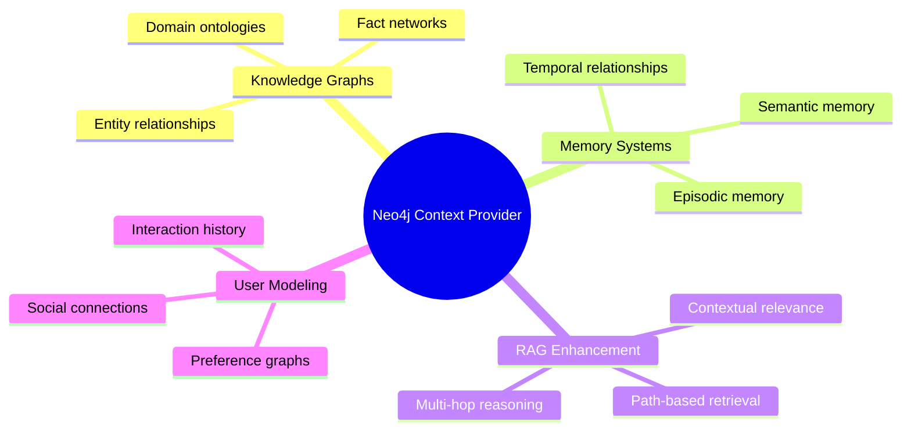

### Potential Use Cases

#### 1. Knowledge Graph RAG

Enhance retrieval with relationship-aware context:

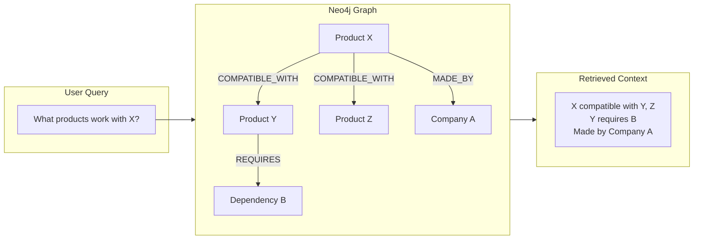

#### 2. Conversational Memory with Relationships

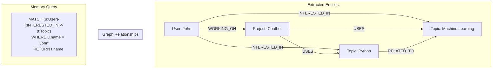

#### 3. Multi-Hop Reasoning

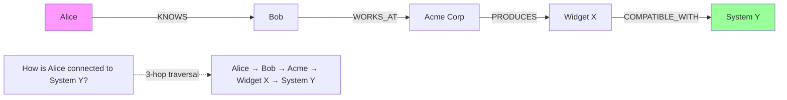

### Neo4j Context Provider Design

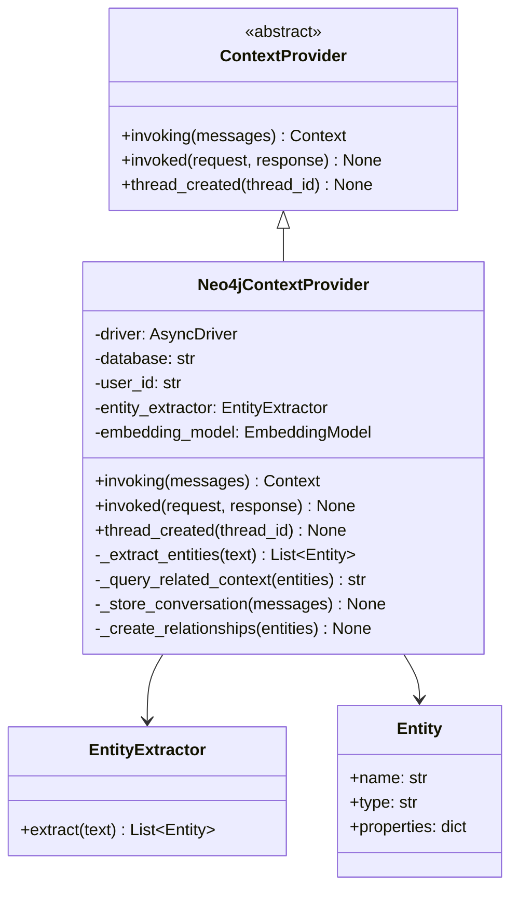

### Implementation Skeleton

```python
from neo4j import AsyncGraphDatabase
from agent_framework import ContextProvider, Context, ChatMessage
from typing import Any
from collections.abc import MutableSequence, Sequence
from pydantic import BaseModel

class Entity(BaseModel):
    """An entity extracted from conversation."""
    name: str
    type: str  # Person, Organization, Topic, Product, etc.
    properties: dict[str, Any] = {}

class Neo4jContextProvider(ContextProvider):
    """Context provider backed by Neo4j graph database.

    Provides:
    - Knowledge graph retrieval for RAG
    - Relationship-aware memory
    - Entity extraction and linking
    - Multi-hop reasoning context
    """

    def __init__(
        self,
        uri: str,
        auth: tuple[str, str],
        database: str = "neo4j",
        user_id: str | None = None,
        chat_client: Any = None,  # For entity extraction
        max_hops: int = 2,
        max_results: int = 10,
    ):
        self._uri = uri
        self._auth = auth
        self._database = database
        self._user_id = user_id
        self._chat_client = chat_client
        self._max_hops = max_hops
        self._max_results = max_results
        self._driver = None
        self._thread_id: str | None = None

    async def __aenter__(self):
        """Initialize Neo4j driver."""
        self._driver = AsyncGraphDatabase.driver(self._uri, auth=self._auth)
        # Verify connectivity
        await self._driver.verify_connectivity()
        return self

    async def __aexit__(self, exc_type, exc_val, exc_tb):
        """Close Neo4j driver."""
        if self._driver:
            await self._driver.close()

    async def thread_created(self, thread_id: str | None) -> None:
        """Track conversation thread."""
        self._thread_id = thread_id

        # Optionally create a Conversation node
        if thread_id and self._driver:
            async with self._driver.session(database=self._database) as session:
                await session.run(
                    """
                    MERGE (c:Conversation {id: $thread_id})
                    SET c.created_at = datetime()
                    WITH c
                    MATCH (u:User {id: $user_id})
                    MERGE (u)-[:HAS_CONVERSATION]->(c)
                    """,
                    thread_id=thread_id,
                    user_id=self._user_id,
                )

    async def invoking(
        self,
        messages: ChatMessage | MutableSequence[ChatMessage],
        **kwargs: Any
    ) -> Context:
        """Query Neo4j for relevant context before LLM invocation."""
        messages_list = [messages] if isinstance(messages, ChatMessage) else list(messages)

        # Extract the query text from recent messages
        query_text = "\n".join(
            msg.text for msg in messages_list
            if msg and msg.text
        )

        if not query_text or not self._driver:
            return Context()

        # Extract entities from the query
        entities = await self._extract_entities(query_text)

        # Query Neo4j for related context
        context_text = await self._query_related_context(entities, query_text)

        if not context_text:
            return Context()

        return Context(
            instructions=f"## Knowledge Graph Context\n{context_text}"
        )

    async def invoked(
        self,
        request_messages: ChatMessage | Sequence[ChatMessage],
        response_messages: ChatMessage | Sequence[ChatMessage] | None = None,
        invoke_exception: Exception | None = None,
        **kwargs: Any,
    ) -> None:
        """Store conversation entities and relationships in Neo4j."""
        if invoke_exception or not self._driver:
            return

        # Combine request and response for entity extraction
        all_messages = []
        if isinstance(request_messages, ChatMessage):
            all_messages.append(request_messages)
        else:
            all_messages.extend(request_messages)

        if response_messages:
            if isinstance(response_messages, ChatMessage):
                all_messages.append(response_messages)
            else:
                all_messages.extend(response_messages)

        # Extract and store entities
        for msg in all_messages:
            if msg.text:
                entities = await self._extract_entities(msg.text)
                await self._store_entities(entities, msg)

    async def _extract_entities(self, text: str) -> list[Entity]:
        """Extract entities from text using LLM."""
        if not self._chat_client:
            return []

        from agent_framework import ChatOptions

        class EntityList(BaseModel):
            entities: list[Entity] = []

        result = await self._chat_client.get_response(
            messages=[ChatMessage(role="user", text=text)],
            chat_options=ChatOptions(
                instructions="""Extract entities (people, organizations, topics,
                products, concepts) from the text. Return structured entities.""",
                response_format=EntityList,
            ),
        )

        if result.value and isinstance(result.value, EntityList):
            return result.value.entities
        return []

    async def _query_related_context(
        self,
        entities: list[Entity],
        query_text: str
    ) -> str:
        """Query Neo4j for context related to extracted entities."""
        if not entities or not self._driver:
            return ""

        entity_names = [e.name for e in entities]

        async with self._driver.session(database=self._database) as session:
            # Query for entities and their relationships up to max_hops
            result = await session.run(
                """
                UNWIND $entity_names AS name
                MATCH (e)
                WHERE e.name =~ ('(?i).*' + name + '.*')
                CALL {
                    WITH e
                    MATCH path = (e)-[*1..$max_hops]-(related)
                    RETURN path
                    LIMIT $max_results
                }
                WITH e, relationships(path) AS rels, nodes(path) AS nodes
                RETURN
                    e.name AS entity,
                    [n IN nodes | n.name] AS connected_nodes,
                    [r IN rels | type(r)] AS relationship_types
                LIMIT $max_results
                """,
                entity_names=entity_names,
                max_hops=self._max_hops,
                max_results=self._max_results,
            )

            records = await result.data()

            if not records:
                return ""

            # Format results as context
            context_parts = []
            for record in records:
                entity = record.get("entity", "")
                nodes = record.get("connected_nodes", [])
                rels = record.get("relationship_types", [])

                if nodes and rels:
                    context_parts.append(
                        f"- {entity} is connected to: {', '.join(nodes)} "
                        f"via relationships: {', '.join(rels)}"
                    )

            return "\n".join(context_parts)

    async def _store_entities(
        self,
        entities: list[Entity],
        message: ChatMessage
    ) -> None:
        """Store extracted entities and relationships in Neo4j."""
        if not entities or not self._driver:
            return

        async with self._driver.session(database=self._database) as session:
            for entity in entities:
                # Create or merge entity node
                await session.run(
                    """
                    MERGE (e:Entity {name: $name})
                    SET e.type = $type,
                        e.updated_at = datetime()
                    SET e += $properties
                    WITH e
                    MATCH (c:Conversation {id: $thread_id})
                    MERGE (c)-[:MENTIONS]->(e)
                    """,
                    name=entity.name,
                    type=entity.type,
                    properties=entity.properties,
                    thread_id=self._thread_id,
                )

            # Create relationships between entities mentioned together
            if len(entities) > 1:
                for i, e1 in enumerate(entities):
                    for e2 in entities[i + 1:]:
                        await session.run(
                            """
                            MATCH (e1:Entity {name: $name1})
                            MATCH (e2:Entity {name: $name2})
                            MERGE (e1)-[:MENTIONED_WITH]->(e2)
                            """,
                            name1=e1.name,
                            name2=e2.name,
                        )
```

### Example Usage

```python
from agent_framework import ChatAgent
from agent_framework.azure import AzureAIClient

async def main():
    chat_client = AzureAIClient(...)

    async with Neo4jContextProvider(
        uri="bolt://localhost:7687",
        auth=("neo4j", "password"),
        user_id="user-123",
        chat_client=chat_client,
        max_hops=2,
    ) as neo4j_provider:

        async with ChatAgent(
            chat_client=chat_client,
            instructions="You are a helpful assistant with access to a knowledge graph.",
            context_providers=neo4j_provider,
        ) as agent:

            thread = agent.get_new_thread()

            # The provider will:
            # 1. Extract entities from the query
            # 2. Query Neo4j for related context
            # 3. Inject that context into the LLM call
            # 4. After response, store new entities in the graph

            response = await agent.run(
                "What products are compatible with Widget X?",
                thread=thread
            )
```

### Advanced Neo4j Provider Patterns

#### Vector-Enhanced Graph Search

Combine Neo4j's vector capabilities with graph traversal:

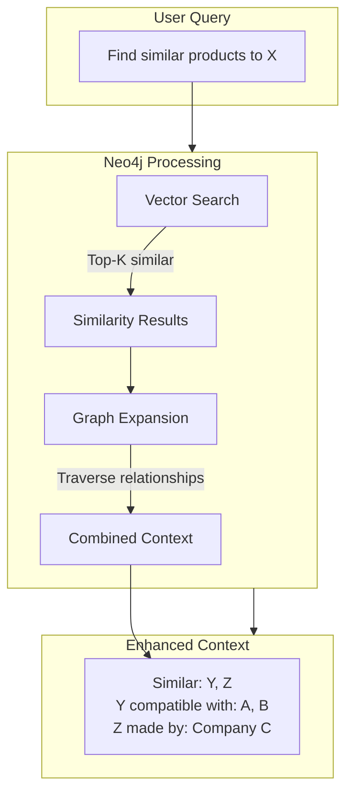

```python
async def _query_with_vectors(self, query_text: str) -> str:
    """Combine vector similarity with graph traversal."""
    # Get embedding for query
    embedding = await self._embedding_model.embed(query_text)

    async with self._driver.session(database=self._database) as session:
        result = await session.run(
            """
            // Vector similarity search
            CALL db.index.vector.queryNodes('entity_embeddings', $k, $embedding)
            YIELD node, score
            WHERE score > $threshold

            // Graph expansion from similar nodes
            MATCH path = (node)-[*1..2]-(related)
            RETURN node.name AS entity,
                   score,
                   collect(DISTINCT related.name) AS related_entities
            ORDER BY score DESC
            """,
            embedding=embedding,
            k=self._max_results,
            threshold=0.7,
        )
        # Format and return context
```

#### Temporal Memory

Track how knowledge evolves over time:

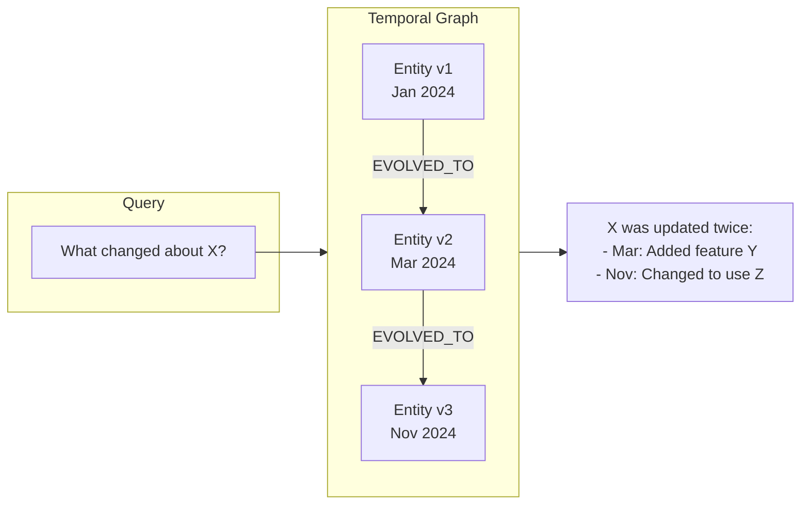

---

## Summary

Context providers offer a flexible way to enhance AI agents with:

- **Memory** - Remember user preferences, conversation history
- **Retrieval** - Inject relevant documents and knowledge
- **Tools** - Dynamically provide capabilities
- **State** - Track and update information across conversations

Neo4j as a context provider brings unique capabilities:

- **Relationship-aware retrieval** - Context includes how entities connect
- **Multi-hop reasoning** - Traverse paths to find indirect relationships
- **Knowledge graphs** - Represent complex domain knowledge
- **Temporal memory** - Track how information evolves

The extensible `ContextProvider` interface makes it straightforward to integrate any data source or memory system into the Agent Framework.
