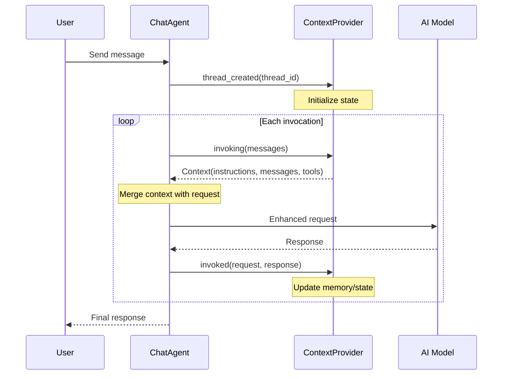

# Neo4j Context Provider Architecture

## Table of Contents

- [Overview: What Are Context Providers?](#overview-what-are-context-providers)
- [Neo4j Provider Architecture](#neo4j-provider-architecture)
- [How the Provider Works](#how-the-provider-works)
- [Sample Walkthroughs](#sample-walkthroughs)
- [Configuration Reference](#configuration-reference)
- [Implemented Features](#implemented-features)
- [Future Work](#future-work)
- [Summary](#summary)

---

## Overview: What Are Context Providers?

Context providers are an extensibility mechanism in the Microsoft Agent Framework that enables AI agents to be enhanced with external context, memory, and retrieval capabilities. Think of them as plugins that automatically inject relevant information into an agent's conversation before the AI model processes each message.

### Why Context Providers Matter

When you chat with an AI agent, it only sees the current conversation. Context providers solve a fundamental problem: how do you give the agent access to your organization's knowledge, documents, or databases without having to manually copy-paste information into every conversation?

Context providers work behind the scenes to:

1. **Retrieve relevant information** from external sources (databases, search indexes, APIs)
2. **Inject that information** into the agent's context before it responds
3. **Update state or memory** after the agent responds

This means the agent can answer questions about your company's data, remember previous conversations, or access real-time information—all automatically.

### How Context Providers Work

Context providers follow a simple lifecycle that hooks into the agent's request/response flow:



**Key lifecycle methods:**

| Method | When Called | What It Does |
|--------|-------------|--------------|
| `invoking()` | Before each LLM call | Retrieves and returns context to enhance the request |
| `invoked()` | After each LLM response | Stores information or updates state based on the conversation |
| `thread_created()` | When a new conversation starts | Initializes thread-specific state |

### What Context Providers Return

When the `invoking()` method runs, it returns a `Context` object containing:

- **Instructions**: Additional system instructions for the agent
- **Messages**: Extra messages to include in the conversation (usually the retrieved content)
- **Tools**: Additional capabilities the agent can use

The agent automatically merges this context with the user's message before calling the AI model.

---

## Neo4j Provider Architecture

### Design Philosophy

The Neo4j Context Provider is designed to follow the same patterns as the Microsoft Agent Framework's built-in providers (Azure AI Search and Redis). This means:

1. **No entity extraction**: The provider passes the full message text to the search index rather than trying to extract keywords or entities. The search index (vector or fulltext) handles relevance ranking.

2. **Index-driven configuration**: You configure which Neo4j index to query and what type of search to perform. The provider works with any index, not a specific schema.

3. **Configurable enrichment**: For graph-aware retrieval, you provide a custom Cypher query that traverses the graph after the initial search. This keeps the provider generic while enabling powerful graph context.

### Integration with neo4j-graphrag

The provider uses the official `neo4j-graphrag` Python library for all retrieval operations. This library provides well-tested, maintained retrievers that handle the complexity of vector search, fulltext search, and hybrid search. The provider acts as an adapter between the Microsoft Agent Framework's `ContextProvider` interface and neo4j-graphrag's retrievers.

**Retrievers used:**
- `VectorRetriever` — For basic vector search
- `VectorCypherRetriever` — For vector search with graph enrichment
- `HybridRetriever` — For combined vector + fulltext search
- `HybridCypherRetriever` — For hybrid search with graph enrichment
- `FulltextRetriever` — Custom implementation for fulltext-only search (with optional graph enrichment)

### Architecture Overview

The provider supports three search types (vector, fulltext, and hybrid) and two result modes (basic and graph-enriched). The following diagram shows the complete data flow from when the agent receives a message to when context is returned:

```
┌──────────────────────────────────────────────────────────────────────────────┐
│                         Neo4jContextProvider                                  │
│                                                                               │
│  Configuration:                                                               │
│    index_name="chunkEmbeddings"                                               │
│    index_type="vector" | "fulltext" | "hybrid"                                │
│    mode="basic" | "graph_enriched"                                            │
│    retrieval_query="MATCH (node)..."  (optional, for graph_enriched mode)     │
├──────────────────────────────────────────────────────────────────────────────┤
│                                                                               │
│  invoking(messages) ──────────────────────────────────────────────────────►  │
│       │                                                                       │
│       ▼                                                                       │
│  ┌─────────────────┐                                                          │
│  │ Concatenate     │  query = "\n".join(msg.text for msg in messages)        │
│  │ Message Text    │  (NO entity extraction)                                 │
│  └────────┬────────┘                                                          │
│           │                                                                   │
│           ▼                                                                   │
│  ┌────────────────────────────────────────────────────────────────────────┐  │
│  │                      Index Type Selection                               │  │
│  ├────────────────────┬────────────────────┬──────────────────────────────┤  │
│  │      VECTOR        │     FULLTEXT       │         HYBRID               │  │
│  │                    │                    │                              │  │
│  │  1. Embed query    │  1. Tokenize query │  1. Embed query              │  │
│  │  2. Vector search  │  2. BM25 search    │  2. Vector + Fulltext        │  │
│  │     YIELD node,    │     YIELD node,    │  3. Combine scores           │  │
│  │     score          │     score          │     YIELD node, score        │  │
│  └────────────────────┴────────────────────┴──────────────────────────────┘  │
│           │                                                                   │
│           ▼                                                                   │
│  ┌────────────────────────────────────────────────────────────────────────┐  │
│  │                       Mode Selection                                    │  │
│  ├───────────────────────────────┬────────────────────────────────────────┤  │
│  │         BASIC MODE            │        GRAPH_ENRICHED MODE             │  │
│  │   (mode="basic")              │   (mode="graph_enriched")              │  │
│  │                               │                                        │  │
│  │   Return: node.text, score    │   Execute retrieval_query:             │  │
│  │   (raw search results)        │                                        │  │
│  │                               │   MATCH (node)-[:FROM_DOCUMENT]-(doc)  │  │
│  │                               │   MATCH (doc)-[:FILED]-(company)       │  │
│  │                               │   OPTIONAL MATCH (company)-[r]->(rel)  │  │
│  │                               │   RETURN node.text, score, metadata    │  │
│  └───────────────────────────────┴────────────────────────────────────────┘  │
│           │                                                                   │
│           ▼                                                                   │
│  ┌─────────────────┐                                                          │
│  │ Format Context  │  Return Context(messages=[ChatMessage(...)])            │
│  └─────────────────┘                                                          │
│                                                                               │
└──────────────────────────────────────────────────────────────────────────────┘
```

### Search Types

| Search Type | neo4j-graphrag Retriever | Best For |
|-------------|--------------------------|----------|
| **Vector** | `VectorRetriever` / `VectorCypherRetriever` | Semantic similarity—finds conceptually related content even if exact words differ |
| **Fulltext** | `FulltextRetriever` | Keyword matching—finds content containing specific terms |
| **Hybrid** | `HybridRetriever` / `HybridCypherRetriever` | Best of both—combines semantic understanding with keyword precision |

### Result Modes

| Mode | Description | Use Case |
|------|-------------|----------|
| **Basic** | Returns search results directly | Fast retrieval, simple Q&A over document chunks |
| **Graph-Enriched** | Runs a custom Cypher query after search to traverse relationships | Complex queries needing company names, related entities, or multi-hop relationships |

### The Retrieval Query Pattern

The key to graph-enriched mode is the `retrieval_query` parameter. This is a Cypher query fragment that:

1. Runs **after** the index search completes
2. Receives `node` and `score` variables from the search
3. Traverses the graph to find related entities
4. Returns structured results with metadata

For example, in a knowledge graph of SEC filings, your retrieval query might traverse from document chunks to their parent documents, then to the company that filed them, and finally to risk factors that company faces. The agent then sees not just the text but also the company name, ticker symbol, and related risks.

---

## How the Provider Works

This section explains how the Neo4j Context Provider processes messages and retrieves context, written in plain English so you can understand the flow without reading the code.

### The Big Picture

When you use the Neo4j Context Provider with an AI agent, here's what happens behind the scenes every time the user sends a message:

```
User sends message
       ↓
Agent Framework calls the provider's "invoking" method
       ↓
Provider searches Neo4j for relevant information
       ↓
Provider returns context to the agent
       ↓
Agent sends message + context to the AI model
       ↓
AI model responds with knowledge from the graph
```

### Step 1: Receiving Messages

When the Agent Framework calls the provider, it passes all the recent messages from the conversation. The provider first filters these messages to keep only the ones from the user and the assistant (ignoring system messages), then takes the most recent messages based on the `message_history_count` setting (default is 10).

**Why use multiple messages?** The conversation context helps the search find more relevant results. If the user asked about "Apple" in a previous message and now asks "What are their risks?", the provider searches for both "Apple" and "risks" together.

### Step 2: Building the Search Query

The provider takes all the filtered messages and combines their text into a single search query. This is a critical design decision: **the provider does NOT try to extract entities or keywords**. Instead, it passes the full conversation text to the search index and lets the index handle relevance ranking.

This approach matches how the Azure AI Search and Redis providers work in the Microsoft Agent Framework. The search index (whether vector or fulltext) is designed to find relevant content—trying to extract entities would be fragile and error-prone.

### Step 3: Executing the Search

Based on the `index_type` configuration, the provider executes one of two search strategies:

**Vector Search** (when `index_type="vector"`):
1. The provider calls the vectorizer to convert the query text into a numerical vector (a list of 1536 numbers for models like `text-embedding-ada-002`)
2. It sends this vector to Neo4j's vector index
3. Neo4j finds nodes whose embeddings are mathematically similar to the query embedding
4. Results come back ranked by similarity score

**Fulltext Search** (when `index_type="fulltext"`):
1. The provider optionally removes common words like "the", "is", and "and" from the query (this improves search quality for natural language questions)
2. It sends the cleaned query to Neo4j's fulltext index
3. Neo4j uses BM25 scoring to find nodes containing the query terms
4. Results come back ranked by relevance score

### Step 4: Graph Enrichment (Optional)

If you configured `mode="graph_enriched"`, the provider doesn't just return the raw search results. Instead, it runs your custom retrieval query to traverse the graph and gather additional context.

Here's what happens:
1. The search finds relevant nodes (like document chunks)
2. Your retrieval query takes those nodes and follows relationships to related entities
3. The final results include not just the text but also metadata like company names, risk factors, or product lists

For example, a search might find a chunk of text about revenue. The retrieval query then follows relationships to discover:
- Which document contains this chunk
- Which company filed that document
- What risk factors that company faces
- What products the company sells

All of this information gets packaged together and returned to the agent.

### Step 5: Formatting Results

Each search result is formatted into a readable string that the AI model can understand. The formatting includes:

- **Score**: How relevant this result is (higher is better)
- **Metadata fields**: Any additional data from the retrieval query (company name, risks, etc.)
- **Text content**: The actual text from the node

For example, a formatted result might look like:
```
[Score: 0.892] [company: Apple Inc] [risks: Competition, Supply Chain]
The Company's products compete with many other products...
```

### Step 6: Returning Context

Finally, the provider packages all the formatted results into a `Context` object that the Agent Framework understands. This includes:

- A context prompt (explaining to the AI how to use the information)
- The formatted search results as additional messages

The agent then merges this context with the user's original message before calling the AI model. From the AI's perspective, it sees both the user's question and relevant information from the knowledge graph.

### Connection Management

The provider uses Python's async context manager pattern for database connections. When you write:

```python
async with provider:
    # Use the provider
```

The provider automatically:
1. Opens a connection to Neo4j when entering the context
2. Verifies the connection is working
3. Keeps the connection open for all searches during the session
4. Closes the connection cleanly when exiting the context

This ensures efficient connection reuse and proper cleanup even if errors occur.

### Component Organization

The implementation is spread across a few files, each with a specific responsibility:

| Component | File | Responsibility |
|-----------|------|----------------|
| **Neo4jContextProvider** | `neo4j_provider/provider.py` | The main class that implements the Agent Framework's context provider interface. Handles message processing, retriever selection, and result formatting. |
| **ProviderConfig** | `neo4j_provider/provider.py` | Pydantic model for configuration validation with field validators and model validators for interdependent options. |
| **AzureAIEmbedder** | `neo4j_provider/embedder.py` | neo4j-graphrag compatible embedder that uses Azure AI / Microsoft Foundry for text embeddings. |
| **FulltextRetriever** | `neo4j_provider/fulltext.py` | Custom retriever for fulltext search (neo4j-graphrag doesn't include one). Supports optional graph enrichment via retrieval queries. |
| **Neo4jSettings** | `neo4j_provider/settings.py` | Pydantic settings for Neo4j connection loaded from environment variables. |
| **AzureAISettings** | `neo4j_provider/settings.py` | Pydantic settings for Azure AI embeddings configuration. |

**External dependencies (neo4j-graphrag):**
- `VectorRetriever`, `VectorCypherRetriever` — Vector search with optional graph traversal
- `HybridRetriever`, `HybridCypherRetriever` — Combined vector + fulltext search
- `Embedder` protocol — Interface that `AzureAIEmbedder` implements

### What Happens After the Response

The provider also has an `invoked()` method that's called after the AI model responds. Currently, this method doesn't do anything, but it's designed for future features like:

- Storing conversation history in Neo4j for long-term memory
- Updating knowledge based on new information in conversations
- Tracking which context was most useful for analytics

This matches the pattern used by the Redis provider, which stores conversation messages for future retrieval.

---

## Sample Walkthroughs

The `src/samples/` directory contains eight working examples demonstrating different capabilities. Each sample is a standalone async function that creates an agent with the Neo4j context provider. This section shows actual output from running each sample.

### Sample 1: Azure Thread Memory (No Neo4j)

**File**: `azure_thread_memory.py`

**What it demonstrates**: How the Microsoft Agent Framework maintains conversation context using Azure-managed threads. **Note**: This sample does NOT use Neo4j—it demonstrates the framework's built-in memory, not the Neo4j provider.

**Sample output**:
```
[Turn 1] User: Hello! My name is Wayne and I love horses.
[Turn 1] Agent: Hi Wayne! That's great to hear. Horses are amazing animals.

[Turn 2] User: What is my name and what do I enjoy?
[Turn 2] Agent: Your name is Wayne, and you enjoy horses.

[Turn 3] User: Can you suggest recommendations for my passion?
[Turn 3] Agent: Here are some recommendations for your passion for horses:
1. Riding Lessons
2. Equestrian Events
3. Volunteering at a stable
...
```

---

### Sample 2: Semantic Search

**File**: `semantic_search.py`

**What it demonstrates**: Direct semantic search using `VectorCypherRetriever` with graph enrichment to show company names and risk factors alongside search results.

**Configuration used**:
- `index_type="vector"` — Uses Neo4j's vector index via `VectorCypherRetriever`
- `mode="graph_enriched"` — Custom retrieval query traverses to Company and RiskFactor nodes
- `embedder=AzureAIEmbedder(...)` — Microsoft Foundry embeddings

**Sample output**:
```
[Query 1] What products does Microsoft offer?

  Result 1 (score: 0.925):
    Company: MICROSOFT CORP
    Text: Microsoft products and services. Surface is designed to help...
    Related Risks: Racial Injustice, Inequity, Competition...

  Result 2 (score: 0.920):
    Company: MICROSOFT CORP
    Text: wide spectrum of technologies, tools, and platforms...
```

---

### Sample 3: Basic Fulltext Search

**File**: `context_provider_basic.py`

**What it demonstrates**: The simplest configuration—fulltext (keyword) search without embeddings.

**Configuration used**:
- `index_type="fulltext"` — Uses Neo4j's fulltext index
- `index_name` — Points to a fulltext index on document chunks
- `top_k=3` — Returns three results
- No vectorizer needed (fulltext doesn't require embeddings)

**How it works**: When you ask "What products does Microsoft offer?", the provider:
1. Extracts keywords from the question
2. Searches the fulltext index for chunks containing those keywords
3. Returns matching chunks as context
4. The agent uses this context to answer with specific product names

**Sample output** (actual run):
```
[Query 1] User: What products does Microsoft offer?

Agent: Microsoft offers a wide range of products, including:

1. **Software and Applications**:
   - Operating systems
   - Cross-device productivity and collaboration applications
   - Server applications
   - Business solution applications

2. **Devices**:
   - PCs and tablets
   - Gaming and entertainment consoles
   - Other intelligent devices

3. **Cloud-Based Solutions**:
   - Microsoft 365
   - Dynamics 365
   - Azure
   - Nuance (Healthcare and enterprise AI)
   - GitHub

4. **AI Solutions**:
   - AI features across Teams, Outlook, Bing, Xbox
   - Microsoft 365 Copilot

[Query 2] User: Tell me about risk factors for technology companies

Agent: Technology companies face several risk factors, including:

1. **Intellectual Property Risks**: Decreased protection in foreign markets
2. **Regulatory Risks**: Compliance with data privacy, antitrust laws
3. **Competition**: Numerous firms across different sectors
4. **Operational Risks**: Cybersecurity breaches, natural events
5. **Financial Risks**: Indebtedness, market fluctuations
```

---

### Sample 4: Vector Search with Microsoft Foundry Embeddings

**File**: `context_provider_vector.py`

**What it demonstrates**: Semantic search using vector embeddings from Microsoft Foundry.

**Configuration used**:
- `index_type="vector"` — Uses Neo4j's vector index via `VectorRetriever`
- `embedder=AzureAIEmbedder(...)` — neo4j-graphrag compatible embedder using Azure's embedding model
- Finds semantically similar content, not just keyword matches

**How it works**: The sample uses `AzureAIEmbedder` which calls Microsoft Foundry's embedding endpoint. When you ask a question:
1. The provider embeds your question into a 1536-dimensional vector
2. Searches for document chunks with similar embeddings
3. Returns conceptually related content even if exact words differ

**Key benefit**: Semantic search understands meaning. A question about "revenue growth" will find chunks discussing "sales increases" or "financial performance" even if those exact words weren't used.

**Sample output** (actual run):
```
[Query 1] User: What are the main business activities of tech companies?

Agent: Tech companies often engage in a variety of business activities:

1. **Research and Development**: Investing in new technologies
2. **Product and Service Development**: Cloud computing, AI, devices
3. **Marketing and Distribution**: OEMs, direct sales, resellers
4. **Intellectual Property Management**: Patents, trademarks, licensing
5. **Security Services**: Identity, network access, data protection
6. **Gaming and Entertainment**: Platforms competing with Nintendo, Sony
7. **Cloud Services**: Azure, business process applications
8. **Consumer Devices**: Manufacturing through third-party partners

[Query 2] User: Describe challenges and risks in the technology sector

Agent: The technology sector faces several challenges and risks:

1. **Rapid Technological Change**: Must keep pace with AI, blockchain, cloud
2. **Intense Competition**: Fierce competition from large and small firms
3. **Cybersecurity Threats**: Increased frequency and sophistication of attacks
4. **Legal and Regulatory Compliance**: Complex regulations around data protection
5. **Cloud Service Execution**: Infrastructure support, market share, security
6. **International Expansion**: Regulatory challenges, economic conditions
7. **Investment Risks**: Investments may not yield expected returns
```

---

### Sample 5: Graph-Enriched Mode

**File**: `context_provider_graph_enriched.py`

**What it demonstrates**: Combining vector search with graph traversal for rich, structured context.

**Configuration used**:
- `mode="graph_enriched"` — Enables custom retrieval query
- Custom `RETRIEVAL_QUERY` that traverses:
  - From Chunk to Document (`FROM_DOCUMENT`)
  - From Document to Company (`FILED`)
  - From Company to RiskFactors (`FACES_RISK`)
  - From Company to Products (`MENTIONS`)

**The retrieval query pattern**:
```
Chunk -[:FROM_DOCUMENT]-> Document <-[:FILED]- Company
Company -[:FACES_RISK]-> RiskFactor
Company -[:MENTIONS]-> Product
```

**Sample output** (actual run):
```
[Query 1] User: What are Apple's main products and what risks does the company face?

Agent: Apple Inc.'s main products include:
- iPhone
- Mac
- iPad
- Wearables, Home and Accessories
- App Store

The company faces several risks:
1. Geography: Variations in different regional markets
2. Aggressive Price Competition: Competitors engage in aggressive pricing
3. Frequent Introduction of New Products: Risks with product launches
4. Short Product Life Cycles: Rapid technological advancements
5. Evolving Industry Standards: Changes require continuous adaptation

[Query 2] User: Tell me about Microsoft's cloud services and business risks

Agent: Microsoft's cloud services, primarily Azure, include:
- Computing, networking, storage, AI, IoT
- Cognitive services and machine learning
- Microsoft Foundry and Azure IoT Edge

Products: Azure, Microsoft Cloud, Microsoft Foundry

Business Risks:
1. **Competitive Risks**: Strong competition from AWS and Google Cloud
2. **Operational Risks**: Depends on reliable, secure service delivery
3. **Security Risks**: Managing large volumes of personal data
4. **Innovation Risks**: Must continue to meet evolving expectations
5. **Infrastructure Costs**: Significant investments may impact margins

[Query 3] User: What products and risks are mentioned in Amazon's filings?

Agent: Products mentioned:
- Amazon Prime
- Kindle
- Fire tablet
- Fire TV
- Echo

Risks highlighted:
- Supply chain disruptions
- Government contracts risks
- Additional tax liabilities
- Foreign exchange rates
- Interest rates
- Inventory risks
- Payment-related risks
- Intense competition
```

Notice how the agent knows both the products AND the risks—information that came from traversing relationships in the graph, not just from the text of individual chunks.

---

### Sample 6: Aircraft Maintenance Search

**File**: `aircraft_maintenance_search.py`

**What it demonstrates**: Using a different database (aircraft domain) with domain-specific retrieval queries.

**Configuration used**:
- Separate credentials for the aircraft database
- Custom retrieval query traversing: `MaintenanceEvent ← Component ← System ← Aircraft`
- Returns: fault, corrective_action, severity, aircraft, system, component

**Purpose**: Shows the provider working with a completely different schema. The same provider code works with any Neo4j knowledge graph—you just change the configuration.

**Sample output** (actual run):
```
[Query 1] User: What maintenance issues involve vibration?

Agent: There are several maintenance issues involving vibration exceedance:

1. **Aircraft: N76758N (A320-200)**
   - System: Generic Avionics Suite
   - Component: Navigation Receiver
   - Corrective Action: Adjusted tolerance
   - Severity: MAJOR

2. **Aircraft: N32276J (A320-200)**
   - System: Generic Avionics Suite
   - Component: Flight Management System
   - Corrective Action: Replaced component
   - Severity: MAJOR

3. **Aircraft: N54980C (A321neo)**
   - System: LEAP-1A #1 (Engine)
   - Component: Fan Module
   - Corrective Action: Software patch applied
   - Severity: MINOR

4. **Aircraft: N65164O (A321neo)**
   - System: Generic Avionics Suite
   - Component: Navigation Receiver
   - Corrective Action: Adjusted tolerance
   - Severity: CRITICAL

[Query 2] User: Tell me about electrical faults and how they were fixed

Agent: Electrical faults occurred across different aircraft:

1. **B737-800 (N53032E)** - CFM56-7B #1 Engine
   - Component: Fan Module
   - Severity: Critical
   - Action: Inspected and found no fault

2. **A320-200 (N63098R)** - V2500 #2 Engine
   - Component: Main Fuel Pump
   - Severity: Major
   - Action: Replaced component

3. **A321neo (N96107S)** - Avionics
   - Component: Air Data Computer
   - Severity: Minor
   - Action: Cleaned and reassembled
```

---

### Sample 7: Flight Delays Analysis

**File**: `aircraft_flight_delays.py`

**What it demonstrates**: Analyzing flight operations data with graph context.

**Configuration used**:
- Reduced context (`top_k=2`, `message_history_count=1`) to avoid token overflow
- Graph pattern: `Delay ← Flight → Aircraft, Origin, Destination`
- Returns: cause, minutes, flight, aircraft, route

**Sample output** (actual run):
```
[Query 1] User: What flights were delayed due to weather?

Agent: The flights delayed due to weather were:

1. **Flight NO833**:
   - Delay Duration: 33 minutes
   - Aircraft: N84703L
   - Route: ATL -> LAX

2. **Flight RE834**:
   - Delay Duration: 19 minutes
   - Aircraft: N96107S
   - Route: BOS -> SFO

[Query 2] User: Tell me about security-related delays

Agent: Analysis of Security-Related Delays:

**Frequent Delays:**
- **Flight EX370**: PHX -> SEA, delayed 55 minutes consistently
- **Flight SK370**: BOS -> DEN, delayed 25 minutes repeatedly

**Impacts:**
- EX370 experienced longer delays, affecting subsequent flights
- SK370 faced shorter but still disruptive delays

These patterns suggest recurring security challenges at specific airports.
```

---

### Sample 8: Component Health Analysis

**File**: `component_health.py`

**What it demonstrates**: Querying component status with aggregated maintenance event counts.

**Configuration used**:
- Graph pattern: `Component ← System ← Aircraft`
- Optional: `Component → MaintenanceEvent (count)`
- Returns: component, type, aircraft, system, events, severity

**Notable feature**: The retrieval query includes `count(me)` to aggregate maintenance events per component, showing how graph queries can compute derived values.

**Sample output** (actual run):
```
[Query 1] User: What turbine components have maintenance issues?

Agent:
### N95040A - CFM56-7B #1
- **High-Pressure Turbine**
  - Maintenance Events: 210
  - Severity: Major
  - Context: Significant issues indicating systemic problems

### N46224T - GE CF34-10E #2
- **High-Pressure Turbine**
  - Maintenance Events: 39
  - Severity: Critical
  - Context: Urgent need for rectification

### N46224T - GE CF34-10E #1
- **High-Pressure Turbine**
  - Maintenance Events: 168
  - Severity: Minor
  - Context: High number indicates persistent maintenance needs

[Query 2] User: Tell me about fuel pump components and their maintenance

Agent:
### Aircraft N95040A - CFM56-7B Engines

1. **CFM56-7B #1:**
   - Frequent maintenance events with major severity
   - Shows poor reliability, may need replacement

2. **CFM56-7B #2:**
   - No maintenance events
   - Indicates stable, reliable fuel pump

### Aircraft N46224T - GE CF34-10E Engine
- **GE CF34-10E #2:**
  - Moderate maintenance with major severity
  - Shows some reliability concerns but manageable
```
---

## Configuration Reference

### Constructor Parameters

These parameters are passed when creating a `Neo4jContextProvider` instance:

#### Connection Parameters

| Parameter | Type | Default | Description |
|-----------|------|---------|-------------|
| `uri` | str | None | Neo4j connection URI (e.g., `neo4j+s://xxx.databases.neo4j.io`). Falls back to `NEO4J_URI` environment variable. |
| `username` | str | None | Neo4j username. Falls back to `NEO4J_USERNAME` environment variable. |
| `password` | str | None | Neo4j password. Falls back to `NEO4J_PASSWORD` environment variable. |

#### Index Configuration

| Parameter | Type | Default | Description |
|-----------|------|---------|-------------|
| `index_name` | str | **Required** | Name of the Neo4j index to query. For vector/hybrid: the vector index name. For fulltext: the fulltext index name. |
| `index_type` | "vector" \| "fulltext" \| "hybrid" | "vector" | Type of search to perform. Vector finds semantically similar content; fulltext finds keyword matches; hybrid combines both. |
| `fulltext_index_name` | str | None | Fulltext index name for hybrid search. **Required** when `index_type="hybrid"`. |

#### Search Behavior

| Parameter | Type | Default | Description |
|-----------|------|---------|-------------|
| `mode` | "basic" \| "graph_enriched" | "basic" | How results are returned. Basic mode returns raw search results; graph-enriched mode runs a custom Cypher query for additional context. |
| `top_k` | int | 5 | Number of results to retrieve from the search. Higher values provide more context but use more tokens. |
| `retrieval_query` | str | See below | Custom Cypher query for graph traversal. Required when `mode="graph_enriched"`. Must use `node` and `score` variables from the search. |
| `context_prompt` | str | Built-in | System message prepended to context. Tells the AI how to use the retrieved information. |
| `message_history_count` | int | 10 | Number of recent messages to include in the search query. Limits context window usage. |

#### Embedding Parameters

| Parameter | Type | Default | Description |
|-----------|------|---------|-------------|
| `embedder` | neo4j_graphrag.Embedder | None | neo4j-graphrag compatible embedder for converting text to vectors. **Required** when `index_type="vector"` or `index_type="hybrid"`. Use `AzureAIEmbedder` for Microsoft Foundry. |

#### Fulltext Search Parameters

| Parameter | Type | Default | Description |
|-----------|------|---------|-------------|
| `filter_stop_words` | bool | True (for fulltext) | Whether to remove common words like "the", "is", "and" before searching. Improves search quality for natural language queries. |

### Environment Variables

The provider loads these environment variables if constructor parameters aren't provided:

| Variable | Description |
|----------|-------------|
| `NEO4J_URI` | Database connection URI |
| `NEO4J_USERNAME` | Database username |
| `NEO4J_PASSWORD` | Database password |
| `NEO4J_INDEX_NAME` | Default index name |
| `NEO4J_INDEX_TYPE` | Default index type |

### Retrieval Query Format

When using `mode="graph_enriched"`, your retrieval query must:

1. Use the `node` variable (the search result node)
2. Use the `score` variable (the search relevance score)
3. Return at least `text` and `score` columns
4. Use `ORDER BY score DESC` to maintain relevance ranking

Example structure:
```cypher
MATCH (node)-[:RELATIONSHIP]->(related)
OPTIONAL MATCH (related)-[:OTHER_REL]->(more)
RETURN
    node.text AS text,
    score,
    related.name AS related_entity,
    collect(more.name) AS additional_items
ORDER BY score DESC
```

---

## Implemented Features

### Hybrid Search

The provider supports **hybrid search**—combining vector search and fulltext search in a single query using neo4j-graphrag's `HybridRetriever` and `HybridCypherRetriever`.

#### Why Hybrid Search Matters

Vector search and fulltext search each have strengths:

- **Vector search**: Understands meaning and concepts; finds related content even when exact words differ
- **Fulltext search**: Matches exact terms and names; precise for specific entities
- **Hybrid search**: Combines both for the best of both worlds

#### Example Usage

```python
provider = Neo4jContextProvider(
    index_name="chunkEmbeddings",        # Vector index
    index_type="hybrid",
    fulltext_index_name="chunkFulltext", # Fulltext index
    mode="graph_enriched",               # Optional graph traversal
    retrieval_query=COMPANY_RISKS_QUERY,
    embedder=embedder,
)
```

---

## Future Work

### Neo4j-Backed Conversation Memory

The provider's `invoked()` method is currently a stub. A future enhancement could store conversation history in Neo4j for long-term memory, enabling:

- Persistent conversation memory across sessions
- Memory retrieval based on semantic similarity to current conversation
- Knowledge graph updates based on new information in conversations

### Additional Retrievers

The neo4j-graphrag library supports additional retrievers that could be integrated:

- `Text2CypherRetriever` — Natural language to Cypher query generation
- Custom retrievers for specific use cases

---

## Summary

The Neo4j Context Provider enables AI agents to access knowledge graph data automatically. Key architectural decisions:

1. **Built on neo4j-graphrag** — Uses the official library's retrievers (`VectorRetriever`, `HybridRetriever`, etc.) for reliable, well-tested search
2. **Index-based search** rather than entity extraction—the search index handles relevance
3. **Configurable retrieval queries** for graph-aware context—keeps the provider generic
4. **Support for vector, fulltext, and hybrid search**—choose based on your use case
5. **Pydantic configuration validation**—catches configuration errors early with clear messages
6. **Following framework patterns**—works like Azure AI Search and Redis providers

The provider transforms Neo4j from a database you query manually into a knowledge source that enhances every agent conversation automatically.
